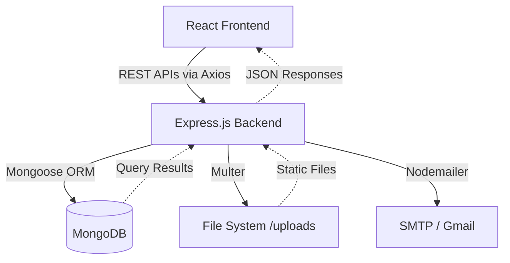
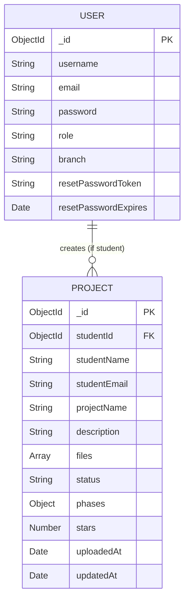
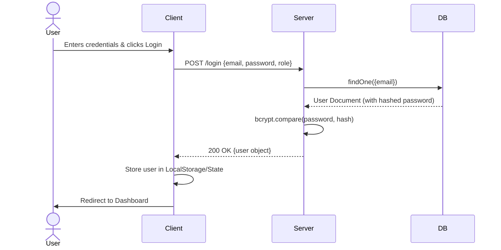
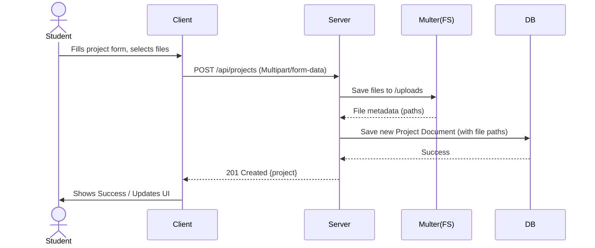
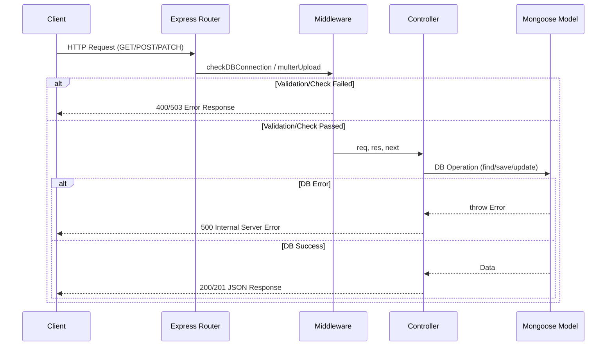
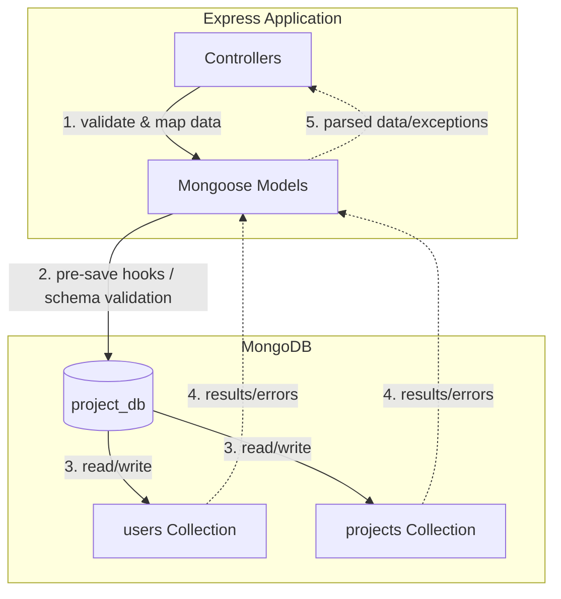

# APRS - Academic Project Repository & Skill Mapping System Architecture

## Section 1: Project Overview
- **What is this project about?**
  APRS (Academic Project Repository System) is a centralized platform for managing college academic projects, tracking student skills, and bridging the gap between student capabilities and industry requirements.
- **What problem does it solve?**
  It provides a GitHub-like project management experience for students to upload their academic projects across a 6-phase lifecycle. It allows teachers to review/approve projects and tracks skills/progress to connect student capabilities with industry expectations.
- **Who are the target users?**
  Students, Teachers/Faculty, and Industry Experts.

## Section 2: Tech Stack
- **Frontend:** React.js (18.2.0), Vite (7.3.0), React Router (6.20.0), HTML, CSS
- **Backend:** Node.js, Express.js (5.2.1)
- **Database:** MongoDB (using Mongoose 9.1.0)
- **Other tools, libraries, frameworks used:**
  - Icons: Lucide-react (0.294.0)
  - HTTP Client: Axios (1.13.2)
  - Auth: bcryptjs (3.0.3), jsonwebtoken (9.0.3)
  - File Uploads: Multer (1.4.5-lts.1)
  - Email: Nodemailer (7.0.12)
  - Env: dotenv (17.2.3)
  - CORS: cors (2.8.5)
- **List EVERY dependency from package.json:**
  - **Root (`package.json`):**
    - `concurrently` (^9.1.2)
  - **Client (`client/package.json`):**
    - `axios` (^1.13.2)
    - `lucide-react` (^0.294.0)
    - `react` (^18.2.0)
    - `react-dom` (^18.2.0)
    - `react-router-dom` (^6.20.0)
    - `@types/react` (^18.2.43) (dev)
    - `@types/react-dom` (^18.2.17) (dev)
    - `@vitejs/plugin-react` (^4.2.1) (dev)
    - `vite` (^7.3.0) (dev)
  - **Server (`server/package.json`):**
    - `bcryptjs` (^3.0.3)
    - `cors` (^2.8.5)
    - `dotenv` (^17.2.3)
    - `express` (^5.2.1)
    - `jsonwebtoken` (^9.0.3)
    - `mongoose` (^9.1.0)
    - `multer` (^1.4.5-lts.1)
    - `nodemailer` (^7.0.12)

## Section 3: Complete Directory Structure
```
academic-project-repository/
├── README.md                -- Project documentation and quick start guide
├── package.json             -- Root package.json with scripts to run client/server concurrently
├── package-lock.json        -- Root lock file
├── .gitignore               -- Git ignore rules
├── client/                  -- React frontend application
│   ├── index.html           -- Main HTML template
│   ├── package.json         -- Frontend dependencies and scripts
│   ├── package-lock.json    -- Frontend lock file
│   ├── vite.config.js       -- Vite bundler configuration
│   └── src/                 -- Frontend source code
│       ├── App.jsx          -- Main React routing component
│       ├── index.css        -- Global CSS styles
│       ├── main.jsx         -- React application entry point
│       ├── components/
│       │   └── layout/
│       │       ├── DashboardLayout.css  -- Styles for the dashboard layout wrapper
│       │       └── DashboardLayout.jsx  -- Reusable layout wrapper for dashboard pages
│       ├── context/
│       │   └── ThemeContext.jsx -- Context provider for Light/Dark mode state management
│       └── pages/
│           ├── auth/
│           │   ├── ForgotPassword.jsx -- Password reset request page
│           │   ├── LoginPage.css      -- Styles for login page
│           │   ├── LoginPage.jsx      -- User login page
│           │   ├── ResetPassword.jsx  -- Page to reset password via email token
│           │   ├── SignupPage.css     -- Styles for signup page
│           │   └── SignupPage.jsx     -- User registration page
│           ├── common/
│           │   ├── BranchSelection.css -- Styles for branch selection
│           │   ├── BranchSelection.jsx -- Branch selection page for teachers
│           │   ├── HelpPage.jsx        -- Help/Support page
│           │   ├── LandingPage.css     -- Styles for the landing page
│           │   ├── LandingPage.jsx     -- Main entry landing page
│           │   ├── ProfilePage.jsx     -- User profile viewing/editing page
│           │   ├── RoleSelection.css   -- Styles for role selection
│           │   ├── RoleSelection.jsx   -- Choose between student/teacher/expert
│           │   └── SupportPages.css    -- Additional common styles
│           └── dashboards/
│               ├── HomeDashboard.css            -- Styles for home dashboard
│               ├── HomeDashboard.jsx            -- Overview dashboard
│               ├── IndustryExpertDashboard.css  -- Styles for expert dashboard
│               ├── IndustryExpertDashboard.jsx  -- Industry expert view of projects
│               ├── StudentDashboard.css         -- Styles for student dashboard
│               ├── StudentDashboard.jsx         -- Student view to upload and track projects
│               ├── TeacherDashboard.css         -- Styles for teacher dashboard
│               └── TeacherDashboard.jsx         -- Teacher view to review/approve projects
└── server/                  -- Node.js/Express backend application
    ├── package.json         -- Backend dependencies and scripts
    ├── package-lock.json    -- Backend lock file
    ├── uploads/             -- Directory for storing uploaded files locally
    │   └── [files]          -- Example files (e.g., .png)
    └── src/                 -- Backend source code
        ├── app.js           -- Express app setup and middleware configuration
        ├── index.js         -- Server entry point and database connection
        ├── config/
        │   └── db.js        -- MongoDB connection logic
        ├── controllers/
        │   ├── auth.controller.js    -- Logic for login, signup, password reset
        │   ├── project.controller.js -- Logic for project CRUD, file uploads, phase updates
        │   └── student.controller.js -- Logic for fetching students and their project status
        ├── middleware/
        │   ├── checkDB.js   -- Middleware to verify DB connection before request handling
        │   └── upload.js    -- Multer configuration for file uploads
        ├── models/
        │   ├── Project.js   -- Mongoose schema for academic projects
        │   └── User.js      -- Mongoose schema for users (students, teachers, experts)
        ├── routes/
        │   ├── auth.routes.js    -- Routes for authentication endpoints
        │   ├── project.routes.js -- Routes for project endpoints
        │   └── student.routes.js -- Routes for student data endpoints
        └── utils/
            └── email.js     -- Nodemailer setup for sending password reset emails
```

## Section 4: Architecture Pattern
- **Architecture Pattern:** Client-Server Monolithic Backend with a SPA (Single Page Application) Frontend. The backend follows a standard layered Clean Architecture/MVC style for API development (Routes → Controllers → Models).
- **Architecture Flow:**


## Section 5: Current Features (ALREADY IMPLEMENTED)
- **User Authentication (Signup/Login):**
  - **Files:** `client/src/pages/auth/SignupPage.jsx`, `client/src/pages/auth/LoginPage.jsx`, `server/src/controllers/auth.controller.js`
  - **How it works:** Users can sign up as Student, Teacher, or Expert. Passwords are encrypted with bcrypt.
  - **Status:** Complete.
- **Password Reset:**
  - **Files:** `client/src/pages/auth/ForgotPassword.jsx`, `client/src/pages/auth/ResetPassword.jsx`, `server/src/utils/email.js`, `server/src/controllers/auth.controller.js`
  - **How it works:** Users request a reset link. Backend generates a token, sends an email via Nodemailer. User clicks link, enters new password.
  - **Status:** Complete.
- **Project Upload & Management:**
  - **Files:** `client/src/pages/dashboards/StudentDashboard.jsx`, `server/src/controllers/project.controller.js`, `server/src/middleware/upload.js`
  - **How it works:** Students can upload project details and files (up to 10 files, 50MB max). Files are stored on local disk via Multer.
  - **Status:** Complete.
- **Role-based Dashboards (Student, Teacher, Industry Expert):**
  - **Files:** `client/src/pages/dashboards/*.jsx`
  - **How it works:** Different UI and data points depending on the logged-in role. Students see their projects. Teachers can see all projects or filter by branch. Experts have a view of projects based on tech stack/domain.
  - **Status:** Partially done (Hardcoded data exists in Expert/Teacher dashboards).
- **Project Phases Tracking (6 Phases):**
  - **Files:** `server/src/models/Project.js`, `server/src/controllers/project.controller.js`
  - **How it works:** Projects go through 6 phases (Idea, Research Paper, Building Prototype, Completing Prototype, Completing Model, Final Submission). Completion auto-calculates a star rating out of 6.
  - **Status:** Complete (Backend logic exists, frontend interaction in StudentDashboard).
- **Dark Mode / Theming:**
  - **Files:** `client/src/context/ThemeContext.jsx`
  - **How it works:** Toggles a CSS class on the `body` tag, storing preference in `localStorage`.
  - **Status:** Complete.

## Section 6: Database Schema

### Table/Collection: `users`
| Field | Type | Description |
|-------|------|-------------|
| `_id` | ObjectId | Primary Key |
| `username` | String | User's name |
| `email` | String | Unique email |
| `password` | String | Hashed password |
| `role` | String | Enum: 'student', 'teacher', 'expert' (Default: 'student') |
| `branch` | String | Department/Branch (CSE, IT, CSBS, etc.) |
| `resetPasswordToken` | String | Token for password reset |
| `resetPasswordExpires` | Date | Expiration time for reset token |

### Table/Collection: `projects`
| Field | Type | Description |
|-------|------|-------------|
| `_id` | ObjectId | Primary Key |
| `studentId` | ObjectId | Ref: 'User' |
| `studentName` | String | Name of the student |
| `studentEmail` | String | Email of the student |
| `projectName` | String | Project Title |
| `description` | String | Project Description |
| `files` | Array of Objects | Uploaded files metadata (filename, originalName, filePath, fileSize, fileType, uploadedAt) |
| `status` | String | Enum: 'pending', 'under_review', 'approved', 'needs_revision' (Default: 'pending') |
| `phases` | Object | 6 nested objects representing phases (phase1_idea to phase6_final_submission) containing `completed` (Boolean), `completedAt` (Date), `description` (String) |
| `stars` | Number | Auto-calculated 0 to 6 based on completed phases |
| `uploadedAt` | Date | Creation timestamp |
| `updatedAt` | Date | Last modification timestamp |

### ER Diagram


## Section 7: API Endpoints

| Method | Endpoint | Description | Auth Required? | Request Body | Response |
|--------|----------|-------------|----------------|--------------|----------|
| POST | `/signup` | Register new user | No | `username, email, password, role, branch` | User object |
| POST | `/login` | Authenticate user | No | `email, password, role` | User object (Note: NO JWT returned currently) |
| POST | `/update-password` | Update current user password | No (Relies on passing userId) | `userId, currentPassword, newPassword` | Success message |
| POST | `/forgot-password` | Send password reset email | No | `email` | Success message |
| POST | `/reset-password/:token` | Reset password using token | No | `password` | Success message |
| POST | `/api/projects/` | Create a new project (Multipart Form) | No | `studentId, studentName, studentEmail, projectName, description, files` | Project object |
| GET | `/api/projects/` | Get all projects | No | None | Array of Projects |
| GET | `/api/projects/student/:studentId` | Get projects by student ID | No | None | Array of Projects |
| GET | `/api/projects/:projectId` | Get a specific project by ID | No | None | Project object |
| PATCH | `/api/projects/:projectId/status` | Update project status | No | `status` | Updated Project |
| PATCH | `/api/projects/:projectId/phase` | Update a single phase status | No | `phase, completed, description` | Updated Project |
| PATCH | `/api/projects/:projectId/phases` | Update multiple phases | No | `phases` object | Updated Project |
| GET | `/api/students/` | Get all students | No | None | Array of Students |
| GET | `/api/students/branch/:branch` | Get students and their latest project by branch | No | None | Array of Students with Project Info |

*(Note: Every endpoint has a `checkDBConnection` middleware but NO authentication/authorization middleware.)*

## Section 8: Authentication & Authorization
- **How is auth handled?** Authentication is currently handled very loosely. The `/login` endpoint verifies credentials and returns a user object. However, **NO JWT or Session is returned or validated on subsequent requests.** State is completely managed client-side (e.g., storing user object in LocalStorage or React state), which is insecure. The `jsonwebtoken` package is in `package.json` but never used in `auth.controller.js`.
- **Are there roles?** Yes: `student`, `teacher`, `expert`.
- **Which routes are protected?** **NONE.** There is no token validation middleware protecting the `/api/projects` or `/api/students` endpoints.

## Section 9: Frontend Pages & Components
- **Pages/Screens:**
  - `LandingPage` (/)
  - `RoleSelection` (/role-selection)
  - `LoginPage` (/login/:role)
  - `SignupPage` (/signup/:role)
  - `TeacherDashboard` (/teacher)
  - `BranchSelection` (/teacher/branches)
  - `StudentDashboard` (/student)
  - `IndustryExpertDashboard` (/expert)
  - `HomeDashboard` (/home)
  - `ProfilePage` (/profile)
  - `HelpPage` (/help)
  - `ForgotPassword` (/forgot-password)
  - `ResetPassword` (/reset-password/:token)
- **Reusable Components:**
  - `DashboardLayout` (Wraps dashboards with a common sidebar/navbar)
- **Routing Structure:** React Router DOM handling client-side routing.
- **State Management:** React local state (`useState`, `useEffect`) and Context API (`ThemeContext`). No Redux or Zustand. Hardcoded URLs to `http://localhost:5000` are used in components instead of a configured Axios instance.

## Section 10: Third-Party Integrations
- **Any external APIs used?** No external REST APIs used directly.
- **Any cloud services?** No. Files are stored on local disk via Multer (`server/uploads/`).
- **Payment gateways?** None.
- **Email services?** Gmail SMTP via Nodemailer (`server/src/utils/email.js`). Requires App Passwords.

## Section 11: Configuration & Environment
- **Environment Variables:**
  ```env
  PORT=5000
  MONGODB_URI=mongodb://127.0.0.1:27017/project_db
  FRONTEND_URL=http://localhost:3000
  EMAIL_USER=your-email@gmail.com
  EMAIL_PASS=your-app-password
  ```
- **Local Setup (Step-by-step):**
  1. Ensure MongoDB is running locally on port `27017`.
  2. Run `npm run install:all` in the root directory.
  3. Create `server/.env` and add the variables listed above.
  4. Run `npm run dev` in the root directory to start both frontend and backend concurrently.

## Section 12: What is INCOMPLETE or MISSING
- **Hardcoded Data:**
  - `TeacherDashboard.jsx` and `IndustryExpertDashboard.jsx` contain massive amounts of hardcoded mocked data (`studentsData`, `projectCatalog`) instead of fetching from the backend endpoints.
  - Hardcoded API base URL `http://localhost:5000` inside Axios calls instead of using Vite environment variables (e.g., `import.meta.env.VITE_API_URL`).
- **Authentication/Security:**
  - Login does not issue a JWT.
  - API routes are completely unprotected. Anyone can update any project or password if they know the ID.
  - Passwords are updated via `userId` in the body of `/update-password`, which is extremely insecure without session/token verification.
- **Error Handling:**
  - Catch blocks in React components often lack UI feedback (just `console.error`).
- **Features missing/TODOs:**
  - The JWT library is installed but not used.
  - The file upload feature stores files statically, but the frontend doesn't seem to have a robust way to delete or manage them post-upload.
  - Many dashboard metrics (like Quick Stats in `HomeDashboard`) are hardcoded.

## Section 13: Code Quality Assessment
- **Proper error handling?** Partial. Backend returns structured JSON error responses. Frontend error handling is minimal (mostly logging to console, relying on basic alerts or missing UI feedback).
- **Input validation?** Minimal. Basic required field checks exist in controllers, relying mostly on Mongoose Schema validation. No library like Joi or express-validator is used.
- **Security vulnerabilities?**
  - CRITICAL: Lack of JWT/session validation on API endpoints.
  - Insecure password update (`/update-password` relies on trusting the client to send the right `userId`).
  - No rate limiting for login/password resets.
- **Modular and clean?** Backend follows MVC well. Frontend components (like Dashboards) are very large due to inlined mock data and could be split into smaller components (e.g., `ProjectCard`, `StatCard`).
- **Code duplications?** Hardcoded lists/data are duplicated. Multiple Axios calls repeat the full `http://localhost:5000` URL.
- **Testing?** No unit, integration, or e2e testing (no Jest, Mocha, or Cypress configurations found).

## Section 14: Data Flow Diagrams

### User Registration / Login Flow


### Main Feature Workflow (Project Upload)


### API Request-Response Cycle (General)


### Database Interaction Flow

